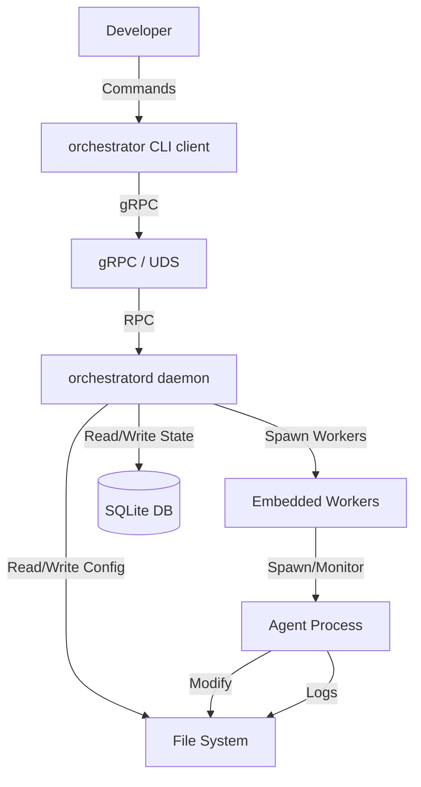

# Agent Orchestrator Architecture

This document describes the architecture of the agent orchestrator system, a local tool designed to automate the AI-native development lifecycle through intelligent agent orchestration. The system is composed of a core library crate (`agent-orchestrator`), a daemon binary (`orchestratord`), and a CLI client binary (`orchestrator`).

## 1. Project Overview

**Goal:** To provide a deterministic, reproducible, and observable environment for AI agents to execute development tasks (QA, Coding, Testing) within a local workspace.

**Key Features:**
- **CLI-First:** All interactions are driven by a command-line interface.
- **Local Execution:** Runs directly on the host machine, managing local processes.
- **Stateful Orchestration:** Persists task state, logs, and events to a local SQLite database.
- **Agent Abstraction:** Treats AI agents (or scripts) as interchangeable, capable execution units defined by shell templates.

## 2. Directory Layout

The project structure is organized as follows:

```
/
├── Cargo.toml            # Workspace root (members: core, crates/*)
├── core/                 # Core Rust library (models, persistence, service layer)
│   ├── src/
│   │   ├── service/      # Pure business logic layer (task, resource, store, system)
│   │   ├── scheduler_service.rs  # High-level enqueue/claim entry points
│   │   └── ...
│   └── Cargo.toml
├── crates/
│   ├── orchestrator-config/  # Configuration models and loading
│   ├── orchestrator-scheduler/ # Scheduler engine (task loop, phases, guards, traces)
│   ├── proto/            # gRPC codegen (tonic + prost)
│   │   ├── src/lib.rs    # Generated types + re-exports
│   │   └── build.rs      # tonic_build
│   ├── daemon/           # orchestratord binary
│   │   └── src/
│   │       ├── main.rs   # Entry point, worker loop, signal handling
│   │       ├── server.rs # OrchestratorService gRPC impl
│   │       └── lifecycle.rs  # PID, socket, shutdown
│   ├── cli/              # orchestrator binary (depends on core for config types)
│   │   └── src/
│   │       ├── main.rs   # Clap commands, dispatch
│   │       ├── client.rs # UDS/TCP gRPC client
│   │       └── commands/ # Command handlers
│   ├── gui/              # Tauri desktop application
│   └── integration-tests/ # Integration test suite
├── proto/
│   └── orchestrator.proto  # gRPC service definition
├── ~/.orchestratord/     # Default runtime data directory (override via ORCHESTRATORD_DATA_DIR)
│   ├── agent_orchestrator.db  # SQLite database
│   ├── orchestrator.sock # Daemon Unix socket (C/S mode)
│   ├── daemon.pid        # Daemon PID file (C/S mode)
│   └── logs/             # Execution logs
├── docs/                 # Documentation & QA/Design artifacts
├── scripts/              # Helper scripts (e.g., `watchdog.sh`)
├── workspace/            # Default location for managed projects/workspaces
└── fixtures/             # Test configurations and data
```

## 3. System Architecture

The system uses a single supported execution model:

1. **Client/Server mode**: A long-running daemon (`orchestratord`) that holds all state and exposes a gRPC API, plus a lightweight CLI client (`orchestrator`) that communicates over Unix Domain Socket or secure TCP.

### 3.1 High-Level Design



**Workspace layout** (C/S mode):

```
crates/
  orchestrator-config/     # Configuration models and loading
  orchestrator-scheduler/  # Scheduler engine (task loop, phases, guards, traces)
  proto/                   # gRPC service definitions (tonic + prost)
  daemon/                  # orchestratord binary (gRPC server + embedded workers)
  cli/                     # orchestrator binary (lightweight gRPC client)
  gui/                     # Tauri desktop application
  integration-tests/       # Integration test suite
core/
  src/service/             # Pure business logic layer (task, resource, store, system)
proto/
  orchestrator.proto       # Protocol buffer definitions
```

### 3.2 Core Components

1.  **CLI Interface**:
    *   **Client** (`crates/cli/`): Lightweight gRPC client that sends commands to the daemon.
    *   **Daemon** (`crates/daemon/`): gRPC server that translates RPC calls into service layer calls.
    *   Displays output (tables, JSON, YAML).

2.  **Orchestrator Engine** (`core/` + `crates/orchestrator-scheduler/`):
    *   **Core** (`core/`): Models, persistence, service layer, `scheduler_service.rs` (enqueue/claim tasks).
    *   **Scheduler** (`crates/orchestrator-scheduler/`): Task loop execution, phase runner, loop guards, traces, checkpoints.
    *   **Task Management**: Creates, starts, pauses, and resumes tasks.
    *   **Cycle Loop**: Manages the iterative execution of workflows.
    *   **Process Management**: Spawns and monitors agent processes (shell commands).
    *   **Event System**: Emits structured events (`step_started`, `task_failed`) to the database.

3.  **Data Layer (`core/src/db.rs`)**:
    *   **SQLite**: Stores persistent state including:
        *   `tasks`: Task metadata and status.
        *   `task_items`: Individual items (files) being processed.
        *   `command_runs`: History of executed commands and exit codes.
        *   `events`: Audit log of all system actions.
    *   **File System**:
        *   **Config**: YAML manifests for defining Resources.
        *   **Logs**: Raw stdout/stderr capture from agent processes.

### 3.3 Orchestrator Core Internals

The `core/` service implements an intelligent agent orchestrator responsible for managing the AI-native development lifecycle.

#### Resource Model

The orchestrator manages resources organized hierarchically:

1.  **Project**: Top-level namespace for isolation.
2.  **Workspace**: Defines the file system context (root path, QA targets, ticket directory).
3.  **Agent**: Defines capabilities (e.g., `qa`, `fix`, `retest`) and execution templates (shell commands with placeholders like `{rel_path}`).
4.  **Workflow**: Defines the process flow, including:
    *   **Steps**: Ordered sequence of actions (e.g., `init_once`, `qa`, `ticket_scan`, `fix`, `retest`).
    *   **Loop Policy**: Controls iteration (Once or Infinite) and termination conditions.
    *   **Finalize Rules**: Determines the final status of items and tasks.

#### Execution Model

A **Task** is the unit of execution, binding a Workspace and Workflow to a set of target files.

1.  **Initialization**: The `init_once` step runs to prepare the environment.
2.  **Orchestration Cycle**: The task runs in cycles until completion or manual stop.
    *   **Item Discovery**: The orchestrator identifies **Task Items** (e.g., source files, QA docs) to process.
    *   **Step Execution**: Steps are grouped into contiguous **scope segments**. Task-scoped steps (plan, implement, self_test, qa_doc_gen, align_tests, doc_governance) run **once per cycle**; item-scoped steps (qa_testing, ticket_fix, ticket_scan, fix, retest) fan out **per item**.
        *   **Prehooks**: Dynamic conditions (CEL-based) evaluate whether to Run, Skip, or Branch a step.
        *   **Agent Selection**: The system dynamically selects an Agent that satisfies the step's `required_capability`.
        *   **Command Execution**: The agent's template is rendered and executed as a shell command.
        *   **Result Capture**: Exit codes, stdout/stderr, and artifacts are captured.
        *   **Structured Output Validation**: For `qa`/`fix`/`retest`/`guard`, agent stdout must be valid JSON and is normalized into `AgentOutput` before downstream decisions are made.
        *   **Message Bus Publication**: Each phase publishes `ExecutionResult` to the collaboration bus so downstream logic can consume a consistent structured payload.
    *   **Loop Guard**: At the end of a cycle, the loop policy checks if another cycle is needed (e.g., if unresolved tickets remain).
3.  **State Management**:
    *   State is persisted in a local SQLite database (`tasks`, `task_items`, `command_runs`, `events`).
    *   Events are emitted for real-time observability.

#### Scheduler Layer

- **Queue-Only Task Execution**:
  - `task create/start/resume/retry` enqueue work for daemon workers in C/S mode.
  - Foreground waiting is handled by explicit observer commands such as `task watch` and `task logs --follow`, not lifecycle flags.
- **Worker Models**:
  - `orchestratord --workers N` embeds workers directly in the daemon process.
- **Queue State**:
  - Pending tasks are tracked via task status (`pending`) in SQLite.
  - Worker emits scheduling lifecycle events such as `scheduler_enqueued`.
  - Claims are atomic (`claim_next_pending_task`) to prevent duplicate execution under parallel workers.

#### Service Layer (`core/src/service/`)

Pure business logic embedded by the daemon and exposed through the gRPC server:

- `task.rs` — create, start, pause, resume, delete, retry, list, info, logs
- `resource.rs` — apply manifests, get/describe/delete resources
- `store.rs` — persistent store CRUD and prune
- `system.rs` — debug info, worker status, preflight check
- `bootstrap.rs` — state initialization (sync and async variants)

## 4. Tech Stack

- **Language**: Rust (Edition 2021)
- **CLI Framework**: `clap`
- **Database**: `rusqlite` (SQLite)
- **Async Runtime**: `tokio`
- **RPC**: `tonic` + `prost` (gRPC with Protocol Buffers)
- **Serialization**: `serde`, `serde_json`, `serde_yaml`
- **Scripting**: `cel-interpreter` (for dynamic prehook logic)

## 5. Deployment Model

The Agent Orchestrator is distributed as a Cargo workspace with a core library and two binaries:

| Crate | Type | Purpose |
|-------|------|---------|
| `core` (`agent-orchestrator`) | Library | Core engine — models, persistence, service layer, state management |
| `crates/orchestrator-scheduler` | Library | Scheduler engine — task loop, phase runner, guards, traces |
| `crates/orchestrator-config` | Library | Configuration models and loading |
| `crates/daemon` (`orchestratord`) | Binary | Daemon — gRPC server + embedded workers |
| `crates/cli` (`orchestrator`) | Binary | CLI client — lightweight gRPC client |
| `crates/gui` (`orchestrator-gui`) | Binary | Tauri desktop application |

- **C/S mode**: Daemon (`orchestratord`) runs persistently, CLI client (`orchestrator`) connects via Unix Domain Socket (`data/orchestrator.sock`) or TCP (`--bind`).
- Both binaries require `sqlite3` and standard shell utilities (`bash`, `grep`, etc.) if used by agents.

## 6. Observability

- **Structured Logs**: All significant actions are recorded in the `events` table in SQLite.
- **Execution Logs**: Detailed stdout/stderr from every agent command is stored in `data/logs/{task_id}/`.
- **Debug Command**: The CLI provides a `debug` command to inspect internal state and configuration.

## 7. Self-Bootstrap & Survival Capabilities

The orchestrator is designed with a unique capability to safely modify and compile its own source code through the `self-bootstrap` workflow. This is achieved via a **2-Cycle Execution Strategy** and protected by a robust **4-Layer Survival Mechanism**:

### 7.1 2-Cycle Strategy for Self-Recursion
To isolate production environment modifications from the validation pipeline, the self-bootstrap workflow operates in two distinct cycles:
*   **Cycle 1 (Production)**: Focuses purely on feature development (`plan` -> `qa_doc_gen` -> `implement` -> `self_test`).
*   **Cycle 2 (Validation)**: Acts as a convergence/review phase (`qa_testing` -> `ticket_fix` -> `align_tests` -> `doc_governance`).

### 7.2 The 4-Layer Survival Mechanism
Because the AI agents are given the authority to modify the core orchestrator, structural safeguards prevent the system from permanently destroying its own execution environment:
1.  **Layer 1 (Binary Snapshot)**: At the beginning of a cycle, a known-good release binary is snapshotted to a `.stable` backup file.
2.  **Layer 2 (Self-Test Gate)**: Following any code modifications (the `implement` step), a mandatory `self_test` step compiles the code and runs unit tests (`cargo check && cargo test`). If it fails, the execution halts before permanent damage occurs.
3.  **Layer 3 (Self-Referential Enforcement)**: Workspaces marked as `self_referential: true` enforce strict configuration rules. The orchestrator refuses to start unless the workflow has `auto_rollback: true`, a non-`none` checkpoint strategy, and an enabled builtin `self_test` step. `binary_snapshot: true` remains a strong warning rather than a startup blocker.
4.  **Layer 4 (Watchdog script)**: A background watchdog monitors the live system. If consecutive runtime crashes are detected (indicating a corrupt compiler output managed to slip through), it forcefully restores the `.stable` binary snapshot and restarts the service.
