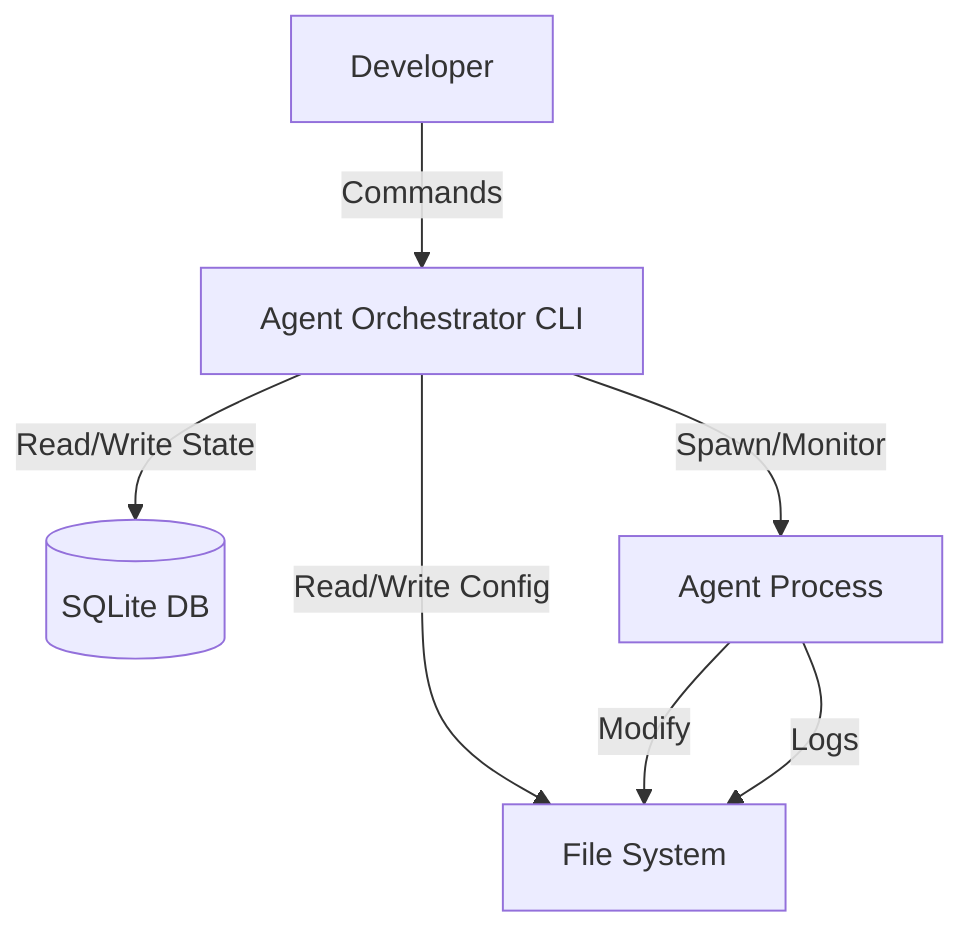

# Agent Orchestrator Architecture

This document describes the architecture of the `agent-orchestrator`, a local CLI tool designed to automate the AI-native development lifecycle through intelligent agent orchestration.

## 1. Project Overview

**Goal:** To provide a deterministic, reproducible, and observable environment for AI agents to execute development tasks (QA, Coding, Testing) within a local workspace.

**Key Features:**
- **CLI-First:** All interactions are driven by a command-line interface.
- **Local Execution:** Runs directly on the host machine, managing local processes.
- **Stateful Orchestration:** Persists task state, logs, and events to a local SQLite database.
- **Agent Abstraction:** Treats AI agents (or scripts) as interchangeable, capable execution units defined by shell templates.

## 2. Directory Layout

The project structure is organized as follows:

```
/
├── core/                 # The core Rust application (CLI & Orchestrator logic)
│   ├── src/              # Source code
│   └── Cargo.toml        # Rust dependencies
├── data/                 # Runtime data storage
│   ├── agent_orchestrator.db  # SQLite database (Task state, Events)
│   └── logs/             # Execution logs (stdout/stderr of agents)
├── docs/                 # Documentation & QA/Design artifacts
│   ├── architecture.md   # This document
│   ├── design-system.md  # (Reference for generated UIs, if any)
│   ├── qa/               # QA test plans
│   └── ticket/           # Failure tickets generated during runs
├── scripts/              # Helper scripts (e.g., `orchestrator.sh`)
├── workspace/            # Default location for managed projects/workspaces
└── fixtures/             # Test configurations and data
```

## 3. System Architecture

The system is a standalone CLI application that orchestrates external processes (Agents) to modify files in a target Workspace.

### 3.1 High-Level Design



### 3.2 Core Components

1.  **CLI Interface (`core/src/cli.rs`)**:
    *   Parses user commands (`init`, `apply`, `task`, `workspace`, `config`).
    *   Displays output (tables, JSON, YAML).

2.  **Orchestrator Engine (`core/src/lib.rs`, `scheduler.rs`)**:
    *   **Task Management**: Creates, starts, pauses, and resumes tasks.
    *   **Cycle Loop**: Manages the iterative execution of workflows.
    *   **Process Management**: Spawns and monitors agent processes (shell commands).
    *   **Event System**: Emits structured events (`step_started`, `task_failed`) to the database.

3.  **Data Layer (`core/src/db.rs`)**:
    *   **SQLite**: Stores persistent state including:
        *   `tasks`: Task metadata and status.
        *   `task_items`: Individual items (files) being processed.
        *   `command_runs`: History of executed commands and exit codes.
        *   `events`: Audit log of all system actions.
    *   **File System**:
        *   **Config**: YAML manifests for defining Resources.
        *   **Logs**: Raw stdout/stderr capture from agent processes.

### 3.3 Orchestrator Core Internals

The `core/` service implements an intelligent agent orchestrator responsible for managing the AI-native development lifecycle.

#### Resource Model

The orchestrator manages resources organized hierarchically:

1.  **Project**: Top-level namespace for isolation.
2.  **Workspace**: Defines the file system context (root path, QA targets, ticket directory).
3.  **Agent**: Defines capabilities (e.g., `qa`, `fix`, `retest`) and execution templates (shell commands with placeholders like `{rel_path}`).
4.  **Workflow**: Defines the process flow, including:
    *   **Steps**: Ordered sequence of actions (e.g., `init_once`, `qa`, `ticket_scan`, `fix`, `retest`).
    *   **Loop Policy**: Controls iteration (Once or Infinite) and termination conditions.
    *   **Finalize Rules**: Determines the final status of items and tasks.

#### Execution Model

A **Task** is the unit of execution, binding a Workspace and Workflow to a set of target files.

1.  **Initialization**: The `init_once` step runs to prepare the environment.
2.  **Orchestration Cycle**: The task runs in cycles until completion or manual stop.
    *   **Item Discovery**: The orchestrator identifies **Task Items** (e.g., source files, QA docs) to process.
    *   **Step Execution**: Steps are grouped into contiguous **scope segments**. Task-scoped steps (plan, implement, self_test, qa_doc_gen, align_tests, doc_governance) run **once per cycle**; item-scoped steps (qa_testing, ticket_fix, ticket_scan, fix, retest) fan out **per item**.
        *   **Prehooks**: Dynamic conditions (CEL-based) evaluate whether to Run, Skip, or Branch a step.
        *   **Agent Selection**: The system dynamically selects an Agent that satisfies the step's `required_capability`.
        *   **Command Execution**: The agent's template is rendered and executed as a shell command.
        *   **Result Capture**: Exit codes, stdout/stderr, and artifacts are captured.
        *   **Structured Output Validation**: For `qa`/`fix`/`retest`/`guard`, agent stdout must be valid JSON and is normalized into `AgentOutput` before downstream decisions are made.
        *   **Message Bus Publication**: Each phase publishes `ExecutionResult` to the collaboration bus so downstream logic can consume a consistent structured payload.
    *   **Loop Guard**: At the end of a cycle, the loop policy checks if another cycle is needed (e.g., if unresolved tickets remain).
3.  **State Management**:
    *   State is persisted in a local SQLite database (`tasks`, `task_items`, `command_runs`, `events`).
    *   Events are emitted for real-time observability.

#### Scheduler Layer

- **Dual Mode Execution**:
  - Foreground: `task create/start/resume/retry` runs inline and waits for completion.
  - Background: `--detach` enqueues tasks; `task worker start` drains pending tasks.
- **Queue State**:
  - Pending tasks are tracked via task status (`pending`) in SQLite.
  - Worker emits scheduling lifecycle events such as `scheduler_enqueued`.

## 4. Tech Stack

- **Language**: Rust (Edition 2021)
- **CLI Framework**: `clap`
- **Database**: `rusqlite` (SQLite)
- **Async Runtime**: `tokio`
- **Serialization**: `serde`, `serde_json`, `serde_yaml`
- **Scripting**: `cel-interpreter` (for dynamic prehook logic)

## 5. Deployment Model

The Agent Orchestrator is distributed as a single binary or run via cargo/scripts.

- **Local Development**:
  - Run via `cargo run --release` or `./scripts/orchestrator.sh`.
  - Requires `sqlite3` and standard shell utilities (`bash`, `grep`, etc.) if used by agents.

## 6. Observability

- **Structured Logs**: All significant actions are recorded in the `events` table in SQLite.
- **Execution Logs**: Detailed stdout/stderr from every agent command is stored in `data/logs/{task_id}/`.
- **Debug Command**: The CLI provides a `debug` command to inspect internal state and configuration.
