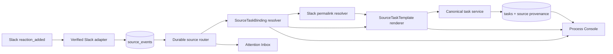

# Slack Reaction Skill Automation Roadmap

**Status**: Proposed
**Governed FRs**: FR-107 through FR-113
**Created**: 2026-07-17
**Target outcome**: 在一条 Slack 消息上添加已绑定的 reaction emoji，即可用对应 Skill 与该消息的稳定链接创建一个可审计、可管理的 Orchestrator 任务

## 1. Problem Statement

真实工作入口经常存在于 Slack：需求、故障、代码讨论和文档请求首先以消息形式出现。用户希望在一条消息上添加一个约定的 badge，例如 `:agent-implement:` 或 `:agent-docs:`，系统就根据 badge 选择一个受治理的 Skill 配置，将 Skill invocation 与 Slack message URL 渲染成任务目标并启动相应 workflow。

这不是一个普通的“Webhook 创建固定任务”需求。它要求同时解决：

- 一个 Slack installation 上存在多个 badge，每个 badge 绑定不同的 Skill 和任务模板；
- 模板与 badge 绑定必须可独立管理、校验、预览、暂停和审计；
- Slack `reaction_added` 事件只携带被 reaction 的消息坐标，任务需要稳定 permalink；
- Slack retry、重复 reaction、删除后重加、daemon 重启和并发路由不能重复创建任务；
- 任务必须保留 source event、模板版本、badge 和消息 URL 的 provenance；
- GUI 应支持日常管理，而不是要求 operator 手工编辑 SQLite 或拼接 YAML。

## 2. Terminology

| Term | Definition |
|---|---|
| Badge | 本路线图中指 Slack reaction emoji；manifest 使用不带冒号的规范名，例如 `agent-implement` |
| Skill | 由管理员配置、由目标 agent runtime 识别的 Skill 标识与 invocation；Slack 用户不能通过消息正文选择任意 Skill |
| Source Task Template | 版本化任务配方，包含 Skill 配置、goal 模板、workflow/workspace action 和允许的输入变量 |
| Source Task Binding | 把一个 Slack installation 下的 reaction 条件绑定到一个 Source Task Template 的规则 |
| Message reference | Slack channel ID、message timestamp 与解析后的 permalink；MVP 不复制消息正文 |
| Route attempt | 从 durable source event 到 binding 选择、permalink 解析、模板渲染和 canonical task creation 的一次可审计尝试 |

## 3. User Journey

1. Operator 在 Process Console 的 Sources → Automations 创建任务模板，选择 Skill、workflow、workspace，并预览渲染结果。
2. Operator 创建 badge binding，把 `agent-implement` 绑定到模板，并限制可用 channel 与 actor role。
3. 用户在某条 Slack 消息上添加 `:agent-implement:` reaction。
4. Slack adapter 校验签名，在 provider deadline 内持久化并确认事件。
5. Source router 规范化 reaction，选择唯一 binding，解析消息 permalink，并渲染版本化模板。
6. Daemon 通过 canonical task service 创建任务；source event、binding、模板快照和 task 形成可追溯关联。
7. 用户在 Sources 或 Process Workspace 中看到任务来源、使用的 badge/Skill、路由状态与 message deep link。
8. 若 binding 歧义、权限不足、Slack API 限流或模板失效，系统不猜测、不静默丢弃，而是进入可重试状态或 Attention Inbox。

## 4. Current Baseline And Gaps

现有 [DD-109](../design_doc/orchestrator/109-source-events-and-slack-binding.md) 已实现：

- Slack 请求签名校验、timestamp tolerance、durable acknowledgement 与 event ID 去重；
- provider-neutral `source_events`、`source_bindings` 与 routing attempts；
- 一个 Slack installation 到一个 Trigger 的解析；
- 固定 Trigger action 的 task creation、thread correlation、Attention 和审计链；
- Sources UI 中的 source provenance。

本需求尚缺少：

- `reaction_added` 的 provider-neutral 语义与 message target contract；
- Slack message permalink resolver 与 outbound credential lifecycle；
- 可复用、可版本化的 Source Task Template；
- badge → template 的多路 binding 与冲突检测；
- binding-selected workflow/workspace/Skill task creation；
- 模板与 binding 的 CLI/GUI 管理、预览和 route simulation；
- 针对 Slack retry、rate limit、restart 和配置变更的完整发布验收。

现有 `StepTemplate` 继续负责 workflow step prompt，不承担 source event 到 task 的路由配方。新的 Source Task Template 位于任务创建边界，二者职责不同。

## 5. Proposed Product Model

下面的 YAML 仅表达目标模型；字段名由 FR-108/FR-109 的设计阶段最终确定。

```yaml
apiVersion: orchestrator.dev/v2
kind: SourceTaskTemplate
metadata:
  name: implement-from-slack
spec:
  skill:
    name: ticket-fix
    invocation: "$ticket-fix"
  action:
    workflow: slack-engineering
    workspace: main
    start: true
  goalTemplate: |
    {skill_invocation}
    Work from this Slack message: {source_message_url}
  allowedVariables:
    - skill_invocation
    - source_message_url
```

```yaml
apiVersion: orchestrator.dev/v2
kind: SourceTaskBinding
metadata:
  name: slack-implement-badge
spec:
  triggerRef: slack-main
  match:
    eventKind: reaction_added
    reaction: agent-implement
    targetKind: message
    channels: [C01234567]
  templateRef: implement-from-slack
  allowedActorRoles: [operator, admin]
  suspend: false
```

核心约束：

- Skill name/invocation、workflow 和 workspace 都来自管理员配置，不来自 Slack 正文或 reaction payload。
- 模板只允许显式 allowlist 变量；未知变量、空 URL、未知资源引用在 apply 或 route 时 fail closed。
- 创建任务时持久化模板内容哈希和 binding revision；后续编辑不能改变历史任务语义。
- 默认幂等键覆盖 project、installation、channel、message timestamp、reaction 和 binding identity。同一 message/badge 不因 Slack retry 或重复 delivery 创建第二个任务。
- `reaction_removed` 默认不取消任务；重新执行走显式 retry/manual run，而不是通过删除、重加 badge 绕过审计。

## 6. Target Architecture



Authority remains in the daemon:

- Slack adapter authenticates and normalizes; it never writes task rows directly.
- Router reads an atomic active-config snapshot and resolves exactly one enabled binding.
- Template renderer is a pure bounded service and never evaluates shell/CEL from Slack-controlled input.
- Task creation reuses queueing, Trigger-compatible lifecycle, action audit and Process Console projections.
- GUI and CLI call resource/service APIs; they never become a second routing engine.

## 7. Roadmap And FR Slices

### Phase A: Contract foundation

| FR | Deliverable | Depends on | Exit gate |
|---|---|---|---|
| FR-107 (Closed): [design](../design_doc/orchestrator/118-slack-reaction-source-event-contract.md), [QA](../qa/orchestrator/155-slack-reaction-source-event-contract.md) | Provider-neutral reaction contract and Slack normalization | FR-099 closure artifacts | Signed `reaction_added` is durable, queryable and never creates a task by itself |
| FR-108 (Closed): [design](../design_doc/orchestrator/119-source-task-template-skill-invocation.md), [QA](../qa/orchestrator/156-source-task-template-skill-invocation.md) | SourceTaskTemplate resource, validation, snapshot and preview renderer | Existing resource/task model | A Skill + message URL template can be applied, round-tripped and rendered deterministically |

FR-107 and FR-108 are closed, so Phase A is complete. Neither slice introduces automatic task mutation alone.

### Phase B: Binding and first vertical task

| FR | Deliverable | Depends on | Exit gate |
|---|---|---|---|
| [FR-109](FR-109-source-task-binding-badge-matching.md) | SourceTaskBinding resource, badge matching, conflict detection and policy fields | FR-107, FR-108 | Exactly one binding is selected or routing fails closed with a stable reason |
| [FR-110](FR-110-slack-permalink-canonical-task-routing.md) | Slack permalink resolution, safe rendering and canonical task creation | FR-107 through FR-109, FR-101 audit envelope | One signed badge event creates one task with correct Skill, URL and provenance |

FR-110 is the MVP boundary. It must be demoable with an isolated daemon and fake Slack API before any management UI is required.

### Phase C: Daily operations

| FR | Deliverable | Depends on | Exit gate |
|---|---|---|---|
| [FR-111](FR-111-source-automation-reliability-policy-operations.md) | Retry/rate-limit/restart behavior, route simulation, CLI observability and Attention policy | FR-110 | Operator can explain and safely retry every non-terminal route state |
| [FR-112](FR-112-process-console-source-automation-ui.md) | Template/binding management UI and recent-route inspection | FR-109 through FR-111, Process Console v1 | Operator can create, preview, bind, suspend and diagnose automation without editing files |

### Phase D: Release closure

| FR | Deliverable | Depends on | Exit gate |
|---|---|---|---|
| [FR-113](FR-113-slack-reaction-skill-automation-release.md) | Aggregate E2E, UI accessibility/regression, upgrade/rollback and user guide | FR-107 through FR-112 | Clean-tree release gate proves signed Slack event → permalink → task → Console provenance |

## 8. Delivery Increments

1. **Contract alpha**: record and inspect reaction events; apply and preview task templates.
2. **Routing alpha**: apply one binding and simulate exact-match/conflict/no-match outcomes without task creation.
3. **MVP pilot**: one installation, one channel, two badges and two Skills create distinct tasks from real signed webhook fixtures.
4. **Operations beta**: deterministic retry, Attention, CLI route inspection and restart recovery.
5. **Console beta**: operator-managed templates/bindings with preview, RBAC and recent-route diagnostics.
6. **Release**: populated upgrade, full UI/E2E, user guide and rollback runbook.

Each increment must be vertically demonstrable. Schema-only, mock-only or UI-only completion does not close a phase.

## 9. Cross-cutting Rules

### Security and trust

- Slack signing secret and outbound API token remain in SecretStore and are redacted from logs, events, task goals and GUI responses.
- `reaction_added` requires authenticated Slack delivery; route authorization uses configured actor-role and channel policies.
- Slack text, emoji names and permalink responses are untrusted input. They cannot select resources, inject template variables or alter execution profiles.
- MVP stores and renders the message URL, not message body, attachments or thread transcript.
- Unknown actor, channel, target kind, Skill, workflow, workspace or duplicate binding fails closed.
- Every apply, preview with privileged data, suspend/resume, route replay and task creation uses the canonical action audit envelope.

### Compatibility

- Existing Slack message/thread routing and fixed Trigger action remain valid.
- Existing Trigger manifests do not require SourceTaskTemplate or SourceTaskBinding.
- New resources and proto fields are additive; old CLI/GUI clients continue to inspect tasks and sources.
- Removing a template or binding is rejected while another active resource references it, or follows an explicit force/orphan policy defined by FR-108/FR-109.

### Reliability

- Persist before acknowledgement and route asynchronously.
- Slack event ID remains the delivery-deduplication key; task idempotency is stronger and based on the message/badge/binding identity.
- Permalink lookup uses bounded timeout, rate-limit-aware retry and no retry inside the webhook response path.
- Config selection uses one atomic snapshot per route attempt; template and binding revisions are recorded with the result.
- Restart reconciliation reclaims stale routing work without duplicating tasks.

### UI and accessibility

- Extend Sources rather than introducing a separate top-level product model.
- Reuse design tokens and dense operational components; readability takes priority over glass effects.
- Provide keyboard operation, visible focus, accessible names, reduced-motion behavior, contrast-safe status, and a no-backdrop-filter fallback.
- Read-only roles can inspect safe metadata but cannot reveal secrets, mutate bindings or replay routes.

## 10. Metrics And Audit

Required metrics are bounded and exclude message bodies, prompts, tokens and permalinks:

- `source_reaction_received_total{provider,result}`
- `source_binding_match_total{provider,result}`
- `source_permalink_resolution_total{provider,result}`
- `source_task_render_total{result}`
- `source_task_creation_total{provider,result}`
- `source_route_latency_seconds{provider,result}`
- `source_route_retry_total{reason}`

Audit/provenance must answer:

- who added the badge and what trusted role was resolved;
- which installation, message reference and reaction were matched;
- which binding revision and template content hash were used;
- which Skill/workflow/workspace were selected;
- which source event, route attempt, request ID and task ID belong together;
- why a route was ignored, retried, blocked or sent to Attention.

## 11. Explicit Non-goals

- Copying Slack message bodies or files into task goals in the MVP.
- Letting any emoji name invoke an arbitrary Skill by convention.
- Cancelling or deleting a task when a reaction is removed.
- Posting progress messages or reactions back to Slack; outbound feedback is a later optional feature.
- Supporting GitHub labels, Linear states or other provider-specific badges in this roadmap, although the core template/binding model should remain provider-neutral.
- Replacing StepTemplate, Workflow or Agent capability selection.
- Hosted multi-tenant Slack OAuth installation management.

## 12. Main Risks

| Risk | Mitigation |
|---|---|
| Duplicate Slack deliveries create duplicate paid agent work | Durable event dedupe plus message/badge/binding task idempotency |
| A custom emoji unexpectedly invokes privileged work | Explicit binding, role/channel allowlists, exact normalized match and audit |
| Template edit changes an already-created task | Persist immutable template hash/revision snapshot on route result |
| Slack API outage blocks webhook acknowledgement | Durable ack first; permalink resolution occurs asynchronously with retry |
| Message URL leaks private workspace context | Role-aware reads, no URL in metrics/logs, bounded retention and no message body ingestion |
| Binding conflicts choose the wrong Skill | Apply-time conflict detection and route-time exactly-one-match rule |
| GUI and daemon render different goals | One daemon renderer used by apply preview, CLI, GUI and live route |

## 13. Planned Closure Artifacts

| FR | Design doc | QA doc | Executable evidence |
|---|---|---|---|
| FR-107 | `docs/design_doc/orchestrator/118-slack-reaction-source-event-contract.md` | `docs/qa/orchestrator/155-slack-reaction-source-event-contract.md` | `scripts/qa/test-slack-reaction-source.sh` |
| FR-108 | `docs/design_doc/orchestrator/119-source-task-template-skill-invocation.md` | `docs/qa/orchestrator/156-source-task-template-skill-invocation.md` | `scripts/qa/test-source-task-template.sh` |
| FR-109 | `docs/design_doc/orchestrator/120-source-task-binding-badge-matching.md` | `docs/qa/orchestrator/157-source-task-binding-badge-matching.md` | `scripts/qa/test-source-task-binding.sh` |
| FR-110 | `docs/design_doc/orchestrator/121-slack-permalink-canonical-task-routing.md` | `docs/qa/orchestrator/158-slack-permalink-canonical-task-routing.md` | `scripts/qa/test-slack-reaction-task-routing.sh` |
| FR-111 | `docs/design_doc/orchestrator/122-source-automation-reliability-operations.md` | `docs/qa/orchestrator/159-source-automation-reliability-operations.md` | `scripts/qa/test-source-automation-operations.sh` |
| FR-112 | `docs/design_doc/orchestrator/123-process-console-source-automation-ui.md` | `docs/qa/orchestrator/160-process-console-source-automation-ui.md` | `scripts/qa/test-source-automation-ui.sh` |
| FR-113 | `docs/design_doc/orchestrator/124-slack-reaction-skill-automation-release.md` | `docs/qa/orchestrator/161-slack-reaction-skill-automation-release.md` | `scripts/qa/test-slack-skill-automation-release.sh` |

FR-113 also owns `docs/guide/slack-reaction-skill-automation.md` and the aggregate release/rollback instructions.

## 14. External Protocol References

- [Slack `reaction_added` event](https://docs.slack.dev/reference/events/reaction_added/)
- [Slack `chat.getPermalink` method](https://docs.slack.dev/reference/methods/chat.getPermalink/)
- [Slack Events API acknowledgement and retry behavior](https://docs.slack.dev/apis/events-api/)

## 15. Roadmap Acceptance

This roadmap is ready for implementation governance when:

- the definition of Badge, Skill and Source Task Template is approved;
- SourceTaskTemplate versus StepTemplate responsibilities are accepted;
- exact-match, authorization, idempotency and no-message-body defaults are accepted;
- FR-107 through FR-113 boundaries and dependency order are accepted;
- MVP closure is explicitly FR-110, while production release closure remains FR-113.
