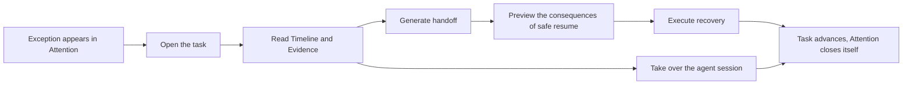

# 08 - Agent Process Console

The Agent Process Console is Agent Orchestrator's graphical control plane for day-to-day operators. It does not ask you to watch every agent's progress. Instead it collects the approvals, exceptions, failures and blockages that genuinely need a person into **Attention**, and then gives you timelines, evidence, handoffs, safe recovery and agent session takeover.

> The single most important operating principle: let agents keep working by default. A person enters the flow only when an exception needs judgement.

This chapter is written for someone opening the Console for the first time, and doubles as an operations manual for daily triage, recovering failed tasks and taking over an agent session. For upgrade, rollback and database restore, use [Agent Process Console v1 Operations](agent-process-console-v1-operations.md) instead.

> **On the name.** The product is the *Agent Process Console*, and that name is unchanged. The thing it manages is a **task** — the same object `orchestrator task` operates on and the same identifier the CLI prints. Before FR-166 the console called that object a "process", which meant the GUI and every other surface used different words for one thing; the console now says task throughout. Hashes minted under the old spelling (`#/processes/...`, `#/new-process`) still resolve.

## 1. If You Only Read One Page

The Console's most common workflow:



When something fails, work in this order:

1. Select the item in **Attention** and read what decision is being asked of you.
2. Click **Claim** if others need to know you have it.
3. Click **Open task** and read the semantic timeline before reaching for raw logs.
4. Select the failing or test entry and check the evidence in the right-hand **Evidence** rail.
5. Click **Generate handoff** to save a short handover summary of the current state.
6. Click **Review safe resume** or **Preview resume**, and choose a logical boundary and a recovery mode.
7. Read the consequence preview, write an operator reason, then execute.
8. Only if you must interact with a running agent, go to **Sessions** and request writer control.
9. Confirm the task has advanced; the corresponding Attention item usually closes itself.

Three safety boundaries to keep in mind:

- **Safe resume is not a workspace rollback.** The Console's recovery plans never roll back files.
- **Repair orphaned running items is not safe resume.** It only repairs running state left behind by a crashed worker.
- **A PID is not session write permission.** Input requires the session's current exclusive writer lease and fencing token.

## 2. Before You Start

### 2.1 Runtime Model

The Console is a Tauri client and the CLI is a client; both reach `orchestratord` over gRPC on a Unix domain socket. The daemon owns SQLite state, authorization, idempotency, session leases, recovery plans and audit evidence.

```text
Console / CLI  ── gRPC / UDS ──>  orchestratord  ──>  SQLite + workers + agent processes
```

Therefore:

- Closing the Console does not stop tasks running in the daemon.
- Refreshing a page does not make the browser or Tauri the authority on state.
- Do not edit SQLite directly to "fix" Attention, session or task state.
- Console, CLI and daemon should come from the same version.

### 2.2 Roles

The Console shows your current role after it starts. The daemon always makes the final authorization decision.

| Capability | `read_only` | `operator` | `admin` |
|---|---:|---:|---:|
| View Attention, Timeline, Evidence, Handoff, Session, Source | yes | yes | yes |
| Claim, Snooze, Resolve, run permitted Attention actions | no | yes | yes |
| Generate handoffs, preview/execute recovery, request session writer control | no | yes | yes |
| Replay a source, change system resources, run administrative operations | no | no | yes |

When a button is unavailable, check your role first and the RuntimePolicy second. Never treat a hidden button or frontend state as the source of permission.

### 2.3 Feature Switches

These RuntimePolicy capabilities affect the Console:

| Capability | Effect |
|---|---|
| `attention_inbox_enabled` | Whether Attention items are produced and read |
| `handoff_enabled` | Whether handoffs may be generated |
| `mutating_resume_enabled` | Whether ordinary safe resume may execute |
| `elevated_resume_enabled` | Whether a non-idempotent boundary may be replayed with extra confirmation |
| `session_read_enabled` | Whether sessions may be read; decided globally by the `_system` policy |
| `session_control_enabled` | Whether writer control is allowed; decided globally by the `_system` policy |
| `session_reclaim_enabled` | Whether unreachable session process groups are reclaimed (default `true`). When the coordinator finds a session process still alive but its input FIFO gone, that process can never be driven again; this switch decides whether its process group is signalled and the session's own directory removed. Set to `false`, coordination still marks the state `failed` but sends no signal — the process survives until the machine reboots. It is a separate switch and **not** part of `session_control_enabled`, which defaults to `false`: hanging it there would mean default deployments never reclaim anything |
| `source_ingest_enabled` | Whether new external source events are accepted |
| `action_audit_mode` | Whether action auditing is in `compatibility` or `enforced` |

The Console's five main pages can each be disabled at build time with `VITE_CONSOLE_ATTENTION`, `VITE_CONSOLE_PROCESSES`, `VITE_CONSOLE_SESSIONS`, `VITE_CONSOLE_SOURCES` and `VITE_CONSOLE_SYSTEM`. When a page shows **Feature unavailable**, an administrator should check the build switch rather than reconnecting repeatedly.

### 2.4 Starting the Console

Start the daemon in one terminal:

```bash
orchestratord --foreground --workers 2
```

On first use, wait for the daemon and run preflight checks in another terminal:

```bash
orchestrator daemon status --wait-ready
orchestrator check --project <project>
```

Then launch the installed **Orchestrator GUI**. The Console discovers the default `~/.orchestratord/orchestrator.sock` automatically. If you use a custom data directory, set the same `ORCHESTRATORD_DATA_DIR` in the daemon, CLI and GUI processes.

To run from source, build the daemon, CLI and frontend first:

```bash
cargo build --workspace --release
npm --prefix gui ci
npm --prefix gui run build
```

Start the daemon, then launch the GUI in another terminal:

```bash
./target/release/orchestratord --foreground --workers 2
./target/release/orchestrator daemon status --wait-ready
cargo run -p orchestrator-gui
```

Desktop installers ship with releases from v0.5.0 onward: a signed and notarized macOS universal `.dmg` and Linux `.AppImage`/`.deb`, named `orchestrator-gui-{tag}-{platform}.{ext}`. The build-from-source flow above is for development.

### 2.5 Signs the Connection Worked

After a successful connection you should see:

- **Orchestrator / Process Console** on the left;
- **Attention** as the landing page;
- your current role in the bottom-left corner;
- no persistent disconnection error at the top;
- **Tasks** and **System** loading real data from the daemon.

If the connection fails, the Console shows connection status and a retry entry point. Start with:

```bash
orchestrator daemon status
orchestrator db status -o json
```

## 3. Navigation and Shortcuts

The Console uses a stable left-hand navigation and copyable local hash deep links.

| Page | Deep link | Purpose | Shortcut |
|---|---|---|---|
| Attention | `#/attention` | Only what needs a person | `Cmd/Ctrl+1` |
| Tasks | `#/tasks` | Every task, and the single-task workspace | `Cmd/Ctrl+2` |
| Sessions | `#/sessions` | Find and take over agent sessions across tasks | `Cmd/Ctrl+3` |
| Sources | `#/sources` | External events, routing state and task provenance | `Cmd/Ctrl+4` |
| System | `#/system` | Operations, agents, resources, triggers, stores and runtime | `Cmd/Ctrl+5` |
| New task | `#/new-task` | Create a task from a description of the goal | `Cmd/Ctrl+N` |

Individual resources also have local deep links:

- `#/attention/<attention-id>`
- `#/tasks/<task-id>`
- `#/sessions/<session-id>`
- `#/sources/<task-id>`
- `#/system/operations`

`#/processes` and `#/new-process` are the pre-FR-166 spellings of the second and sixth rows. They still parse, so bookmarks and handover notes written against them keep working; the Console writes the new spelling back.

These links are for locating and handing over work on the same machine. They are not public web URLs and contain no writer token, transcript or operating permission.

In a narrow window the left navigation collapses into **Menu**. **Theme** and **Reduce transparency** at the bottom switch the theme and reduce transparency effects.

## 4. Attention: Your Default Workbench

### 4.1 What Appears in Attention

Attention shows only the exceptions, approvals, decisions and blockages that need human involvement. A task running normally and autonomously should not appear here.

Severity is either:

- **intervention**: usually needs prompt involvement, and sorts to the front of the queue;
- **attention**: needs notice or a decision, but not necessarily an immediate interruption.

Repeated failures of the same kind aggregate into one active item with an **Occurrences** count rather than producing unbounded duplicate notifications.

### 4.2 Reading the Three Columns

The Attention desktop layout has three columns:

1. **Queue filters**: filter by state, severity and assignee;
2. **Actionable list**: sorted by severity and most recent occurrence;
3. **Decision context**: the requested decision, the task, the step, the assignee, the occurrence count and the actions the daemon permits.

Common filters:

| Filter | Suggested use |
|---|---|
| Open queue | Daily work; only unresolved items |
| Claimed | Items someone has already picked up |
| Snoozed | Check whether deferred items are about to return |
| Resolved history | Review items already resolved |
| Mine | Only items assigned to the current authenticated actor |
| Unassigned | Find items nobody has taken |

### 4.3 Acting on an Item

- **Claim**: declare that you are handling it; this does not change task execution state.
- **Snooze 1h**: temporarily remove it from the active queue; it returns in an hour.
- **Resolve**: confirm the item no longer needs action; audit history is retained.
- **Open task**: go to the corresponding task workspace.
- Other buttons: offered by the daemon in that item's allowlisted actions, with a confirmation dialog before execution.

Do not resolve an item on a still-failing task merely because you have looked at it. Prefer making the task actually advance and let the system close the Attention item from persistent state.

### 4.4 Attention Keyboard Operation

When focus is not in a text field, dropdown or button:

| Key | Action |
|---|---|
| `j` / `↓` | Select the next item |
| `k` / `↑` | Select the previous item |
| `c` | Claim |
| `s` | Snooze for one hour |
| `r` | Open the Resolve confirmation |
| `Enter` | Open the associated task |

Live updates do not move your selection arbitrarily; when the service requires a snapshot reset, the Console tries to preserve the same Attention ID.

### 4.5 Notifications

The Console requests desktop notification permission at startup. Only newly opened or reopened actionable item versions generate a notification; ordinary updates and reconnections do not re-notify.

If the system denies desktop notifications:

- the Attention live list still works;
- the page shows an in-app fallback;
- screen readers still receive announcements through a live region.

Notifications contain only a restricted title, severity, task ID and deep link — never a prompt, transcript, stdout/stderr, source body or secret.

## 5. Tasks: Understand the Work, Don't Chase a Percentage

### 5.1 The Task List

**Tasks** lists the tasks in the daemon, showing running, paused and failed ones first. Running entries update their state and progress live.

Opening a task shows an overview at the top:

- current state and goal;
- workflow and project;
- number of unresolved Attention items;
- number of active sessions;
- completion progress across task items.

The identifier shown here is the same task ID the CLI prints, and `orchestrator task info <task-id>` describes the same object.

### 5.2 Timeline

The Timeline is the default explanatory surface. It projects underlying events into stable, ordered, semantic entries covering:

- goal and provenance;
- lifecycle and loops;
- execution steps and tools;
- tests, artifacts and evidence;
- failure causes;
- human actions, sessions, recovery and completion state.

Finding the last successful entry and then the first failing entry is usually faster than reading raw logs from the top. Use **Load more** when there are many entries; the live buffer deduplicates by stable ID.

### 5.3 Evidence

Selecting a Timeline entry shows the evidence references associated with it in the right-hand **Evidence** rail: command runs, tests, artifacts, log locations, sessions or checkpoints.

`redacted` means the content has been sanitized. Evidence is a set of references for locating real artifacts; it does not promise to inline every raw byte into the page.

### 5.4 Context Rail

To the right of the Timeline, in order:

- **Evidence**: evidence for the selected entry;
- **Handoff & safe resume**: generate a handover summary and recover;
- **Agent session**: read a transcript or request writer control;
- **Source bindings**: Slack, fixture or other external sources bound to this task.

These capabilities share one workspace so that you do not lose the failure context while deciding.

### 5.5 Expert Mode

Click **Expert** or press `Cmd/Ctrl+E` to see:

- trace JSON;
- up to the most recent 500 lines of live raw log;
- raw task/item technical detail;
- the **Repair orphaned running items** maintenance action.

Expert mode is for diagnosis and should not be your daily first stop. In particular:

> Repair orphaned running items only marks running items left by a crashed worker as retryable. It does not select a logical boundary, does not recover a provider session, and does not roll back the workspace.

## 6. Handoff and Safe Resume

### 6.1 When to Generate a Handoff

Generate a handoff when:

- you are about to hand the task to another operator;
- a failure has occurred and you need to rebuild goal, state and evidence quickly;
- you are about to recover and want an immutable snapshot of the pre-recovery state;
- an agent session has exited but a new agent must pick the work up.

Clicking **Generate handoff** produces an immutable summary containing the goal, current state, last success, failure, test evidence, changed files, constraints, decisions, open questions and recommendations. The same event cursor yields the same content hash.

A handoff is handover material. It does not recover the task by itself.

### 6.2 The Full Safe-Resume Sequence

On a failed task, click **Review safe resume** at the top, or **Preview resume** in the right rail:

1. Choose a **logical boundary**.
2. Read that boundary's side-effect class, replayability and reason.
3. Choose a recovery mode.
4. Click **Create preview**.
5. Read the consequences, the plan expiry, and the explicit `Workspace rollback: never`.
6. Write a short, auditable **operator reason**.
7. If the boundary may repeat a non-idempotent external side effect, you must tick elevated confirmation; if the policy is not enabled, stop.
8. Click **Execute reviewed plan**.
9. Read the result; some modes create an associated child task.

A plan is bound to the state version at the time it was created. If the task or workspace state has changed since the preview, execution fails with a stale error. That is the protection working: reload the task, reselect the boundary and create a new plan rather than bypassing the version check.

### 6.3 The Four Recovery Modes

| Mode | When it applies | Key caution |
|---|---|---|
| Continue task | A paused task can proceed from its current state | Completed steps are not replayed |
| Retry failed item | Retry only the explicitly failed item | Confirm the failed operation is retry-safe |
| Restart from boundary | Create a recovery execution from a declared logical boundary | May create an associated child task |
| Resume provider session | Re-enter an existing provider session | Offered only when the boundary declares a session is available |

If a boundary reads **Replay-safe**, still read the reason. If it reads **Elevated confirmation required**, first establish whether the external side effect can be repeated. Do not enable the elevated policy just to make a button clickable.

### 6.4 CLI Equivalents

```bash
# 1. Save a handover snapshot of the current state
orchestrator handoff generate <task-id> -o yaml

# 2. List recoverable boundaries
orchestrator resume boundaries <task-id>

# 3. Create a consequence preview
orchestrator resume plan <task-id> \
  --boundary <boundary-id> \
  --mode restart_from_boundary \
  -o json

# 4. Execute using the ID and expected_state_version the plan returned
orchestrator resume execute <plan-id> \
  --expected-state-version <state-version> \
  --reason "Reviewed failure evidence and selected a replay-safe boundary" \
  --idempotency-key <stable-retry-key>
```

Reuse the same idempotency key when retrying step 4 after a network or client timeout.

## 7. Sessions: Read, Take Over, Release

### 7.1 The Session List

**Sessions** lets you find an agent session without first remembering which task it belongs to. Filter by Active, Detached, Closed or All.

Each row shows:

- the agent;
- the associated task and step;
- session state;
- the current writer actor, or `read-only`.

The **session inspector** reads the transcript and links back to the associated task.

### 7.2 Readers and Writers

- **Reader**: reads the transcript only; multiple readers can hold independent offsets.
- **Writer**: can send input to the agent; one session has at most one effective writer at a time.

The Console records a committed read offset per session. After a reconnect it continues from that offset and ignores chunks it has already received.

### 7.3 Requesting Control

1. Read the transcript first and establish what the agent is currently doing.
2. Click **Request control**.
3. On success the Console holds a writer lease and a monotonically increasing fencing token.
4. Type into the input box and click **Send**, or press `Enter`.
5. Click **Release control** when you are done.

The Console heartbeats to renew the lease. If the lease is lost, expires, or is superseded by a newer fencing token, the old writer can neither send input nor release the new owner's lease.

Input is protected by idempotency keys. A timeout does not mean the agent did not receive the input; let the client retry safely under the same request identity rather than firing off different requests in quick succession.

### 7.4 Closing a Session

**Close session** is an audited process shutdown and is not the same as Release control. Close only when you are sure the session should not continue.

Closing is guarded by session ID, state version and process fingerprint. A PID is for diagnostic lookup only and can never by itself grant close or input permission.

### 7.5 CLI Equivalents

```bash
# List and inspect
orchestrator agent session list -o json
orchestrator agent session get <session-id> -o json

# Read a transcript from an offset
orchestrator agent session read <session-id> --offset 0 --chunks-json

# Request a writer lease; record the fencing token it returns
orchestrator agent session attach <session-id> \
  --mode writer \
  --client-id terminal-a

# Send one idempotent input
orchestrator agent session send-input <session-id> \
  --client-id terminal-a \
  --fencing-token <token> \
  --text "Continue from the reviewed failure" \
  --idempotency-key input-001

# Release writer control
orchestrator agent session detach <session-id> \
  --mode writer \
  --client-id terminal-a \
  --fencing-token <token>
```

When the CLI holds a writer lease for a long time, run `agent session heartbeat` on the cadence the lease response specifies.

## 8. Sources: Entering Work From Slack and External Events

Sources shows provider-neutral external events. Slack is an adapter, not the data model of a task.

### 8.1 Routing States

| State | Meaning | Usual action |
|---|---|---|
| received | Persisted, awaiting routing | Wait, or check the router |
| routing | Being associated with or creating a task | Wait briefly |
| routed | Associated with a task | Click **Open task** |
| needs_attention | Routing cannot be decided safely | Go to Attention for a human decision |
| failed | Routing failed | Admin diagnoses, then replays |
| ignored | Ignored by policy | Usually no action |

Multiple messages in one Slack thread can bind to the same task. A new thread, an explicit branch or an ambiguity produces a different outcome according to routing policy; the system never guesses a target task when the route is ambiguous.

### 8.2 Replay

Only an admin can **Replay** a `failed` or `needs_attention` event. Replay re-queues the persisted event; deterministic source, task and action identity prevent duplicate side effects.

Before replaying, confirm:

1. the signature, permission or routing policy problem is actually fixed;
2. the event has not been manually bound to the wrong task;
3. whether the previous attempt already produced an external side effect;
4. that the related Attention and audit records explain this operation.

CLI diagnostics:

```bash
orchestrator source list --project <project> --state failed -o json
orchestrator source get <source-event-id> -o json
orchestrator source bindings <task-id>
orchestrator source replay <source-event-id>
```

## 9. New Task: Starting From a Goal

Click **New task** at the bottom left or press `Cmd/Ctrl+N`, then describe the goal you want the system to achieve. The current interface accepts up to 2000 characters and uses the existing drafting flow to produce a draft.

A good goal states:

- what should change or be verified;
- the success criteria;
- explicit constraints and anything that must not be touched;
- known files, tickets or external context;
- the verification evidence you want kept.

Submit with the button, or press `Cmd/Ctrl+Enter` in the text box. Once the draft is ready:

- **Confirm development**: create a real execution task from the drafted goal;
- **Modify**: return to the list and keep adjusting;
- **Cancel**: delete the draft after confirmation.

When you need to choose the project, workflow, steps or pipeline variables precisely, prefer the CLI:

```bash
orchestrator task create \
  --name "upgrade-auth-flow" \
  --goal "Implement and verify the approved authentication change" \
  --workflow sdlc \
  --project product-a
```

## 10. System and Operations

System holds platform administration and expert entry points:

| Section | Purpose |
|---|---|
| Operations | Project-level task health and projector status |
| Agents | Inspect and manage agents |
| Workflows & Resources | Manage declarative resources and workflows |
| Triggers | Manage scheduled and event-driven triggers |
| Stores | Inspect workflow persistent stores |
| Secrets | Manage encrypted SecretStores and key operations |
| Runtime & Connection | Runtime, connection and diagnostic information |

### 10.1 Reading Operations

Go to **System → Operations**, enter a project, and choose a 1-hour, 24-hour or 7-day window. Common metrics:

- Attention opened / active;
- time to claim;
- human attention;
- autonomous completion;
- handoff to action;
- resume attempts;
- session attachments;
- source deduplicated;
- repeated failure and degenerate loops;
- timeline latency, response size and stream reconnects.

Operations is a trend and triage tool, not forensic truth. When you need to explain one specific action, go back to Timeline, Evidence and Audit.

These states are worth noticing:

- **Fresh snapshot**: the data was produced recently;
- **Stale snapshot**: refresh took longer than expected;
- **Collection disabled**: metric collection is off by policy, which does not affect task execution;
- **Partial historical coverage**: the window predates current retention;
- projector lag/failure: the projection needs attention, but authoritative business state still lives in the domain tables and events.

CLI query:

```bash
orchestrator metrics process \
  --project <project> \
  --window 24h \
  --bucket 1h \
  -o json
```

## 11. Four Everyday Playbooks

### 11.1 Recovering a Failed Task

1. Claim it in Attention.
2. Open the task.
3. Find the last successful and first failing Timeline entries.
4. Check Evidence; go to Expert for logs if necessary.
5. Generate a handoff.
6. Review safe resume.
7. Choose a replay-safe boundary, create a preview and write a reason.
8. Execute the reviewed plan.
9. Confirm the child task or the original task has advanced and Attention closed itself.

### 11.2 An Approval or Human Decision

1. Read Attention's requested decision, not just the title.
2. Check the associated timeline, source provenance and evidence.
3. Execute only the actions the daemon advertises.
4. Confirm the state change and audit note in the confirmation dialog.
5. If no action is needed any more, resolve with an explicit reason.

### 11.3 Taking Over a Claude Code or Other Agent Session

1. Open the target session from the task context rail or from Sessions.
2. Read the transcript as a reader first.
3. Confirm no other writer holds it, or coordinate with the current owner.
4. Request control.
5. Send one short, verifiable instruction.
6. Watch whether the transcript and the task timeline advance.
7. Release control; do not leave a lease idle.

### 11.4 A Failed Source Route

1. Filter Sources by `failed` or `needs_attention`.
2. Check provider, installation, conversation/thread and error code.
3. Read the corresponding Attention and audit records.
4. Fix the signature, actor role, trigger or binding policy.
5. An admin replays.
6. Confirm exactly one target task or binding was produced, with no duplicate side effects.

## 12. CLI Fallback

When the GUI is unavailable, the core operations remain available through the CLI against the same daemon.

```bash
# Attention
orchestrator attention list --project <project>
orchestrator attention get <attention-id>
orchestrator attention claim <attention-id> --expected-version <version>
orchestrator attention resolve <attention-id> \
  --expected-version <version> \
  --reason "Resolved after reviewed recovery"

# Task / Timeline
orchestrator task info <task-id> -o yaml
orchestrator task timeline <task-id>
orchestrator task timeline <task-id> --category failure --follow
orchestrator task logs <task-id> --timestamps

# Audit
orchestrator audit list --project <project> --status failed -o json
orchestrator audit get <request-id> --project <project>

# Operations
orchestrator metrics process --project <project> --window 24h --bucket 1h
```

Prefer the running binary's own help over copying from older documentation:

```bash
orchestrator guide task
orchestrator guide attention
orchestrator guide session
orchestrator guide source
orchestrator guide audit
orchestrator handoff --help
orchestrator resume --help
orchestrator metrics --help
```

## 13. Troubleshooting

### The Console Shows Disconnected

1. Run `orchestrator daemon status`.
2. Check the daemon's terminal log.
3. Confirm the CLI and GUI use the same `ORCHESTRATORD_DATA_DIR` or control-plane configuration.
4. Click Retry in the Console.
5. Do not fix a connection problem by copying or editing the live SQLite file.

### Attention Is Empty

That is usually good news. Confirm:

- the filter is Open queue;
- you have not accidentally selected Mine, a severity, or resolved history;
- `attention_inbox_enabled` is on;
- the target task actually produced an event that needs a person.

A normally running task not appearing in Attention is by design.

### A Button Is Disabled or Missing

Check in order:

1. whether your role satisfies the requirement;
2. whether the corresponding RuntimePolicy is enabled;
3. whether session read/control is enabled by the `_system` policy;
4. whether the current state permits the action;
5. whether the page was disabled by a `VITE_CONSOLE_*` build switch.

Do not work around button state by changing the frontend; the daemon still rejects the request.

### Attention or Recovery Reports a Stale Version

The data you are looking at has been updated by another operator or by the task itself:

1. refresh the snapshot or reopen the task;
2. re-read the current version / state version;
3. regenerate the recovery plan;
4. review the consequences again, then execute.

### A Session Will Not Grant Request Control

Possible causes:

- `_system.session_control_enabled=false`;
- your role is `read_only`;
- an unexpired writer already holds it;
- the session has exited or closed, or the process fingerprint does not match;
- an old fencing token is no longer valid.

Refresh the session first. Never send input by PID or kill the process to seize a lease.

### A Session Transcript Duplicates or Disconnects

The Console deduplicates by `next_offset` and reconnects from the committed offset. Wait for the automatic reconnect; if it keeps failing, record the session ID and request ID and check the daemon log. Do not clear persistent state to "reset the offset".

### A Source Stays Failed

Before replaying, check the signature time window, provider configuration, trigger, actor role, binding ambiguity and `source_ingest_enabled`. Repeated replays cannot fix a deterministic configuration error.

### Operations Has No Data or Reads Stale

- confirm the project spelling;
- switch to a larger window;
- check collection enabled, coverage and projector health;
- re-query with the CLI;
- a metrics failure does not block a task, so do not change authoritative task state because of one.

### An Error Contains a Request ID

Keep the whole request ID and use it to query the audit trail and correlate the daemon log:

```bash
orchestrator audit get <request-id> --project <project>
```

Do not quote only the error text; a request ID distinguishes an authorization failure from a stale version, a fencing failure, a policy rejection and a domain error.

## 14. Accessibility and Comfort

- Every critical operation is reachable by keyboard; dialogs support `Escape`, focus trapping and focus restoration on close.
- State is conveyed by text and shape as well as colour, never colour alone.
- When the system requests reduced motion, non-essential animation is removed.
- Where backdrop blur is unsupported, or **Reduce transparency** is on, surfaces use opaque backgrounds.
- Read-only users are not given hidden-but-focusable mutation or session input controls.
- In a narrow window content stacks in order and should never produce a horizontal scroll of the whole page.

If visual transparency makes reading harder, turn on **Reduce transparency** rather than changing system data or disabling feature pages.

## 15. Habits Worth Keeping

- Start the day in Attention, not in the full task list.
- Claiming means you are responsible, not that the problem is solved.
- Read the semantic timeline and evidence first and raw logs last.
- Generate a handoff whenever work crosses a person, a session or a recovery boundary.
- Always create and read a consequence preview before recovering.
- Write "why this boundary is safe now" in the operator reason, not `retry`.
- Keep session input short, single-intent and verifiable.
- Release writer control as soon as you are done.
- Fix the deterministic cause before replaying a source.
- Use Audit for forensics on a specific action, and Operations for trends.
- Do not edit SQLite, do not delete migration records, and do not confuse a normal rollback with a database rollback.

## 16. Glossary

| Term | Meaning |
|---|---|
| Task | The persistent execution aggregate in the daemon. It is what the CLI, the API, the audit trail and the Console all call this object. The Console showed it as "process" before FR-166 |
| Attention item | A persistent queue entry needing human judgement or action |
| Timeline | A stable, paginated, semantic read-only projection built from events |
| Evidence | References to tests, commands, artifacts and logs associated with a Timeline entry |
| Handoff | An immutable handover summary at one event cursor |
| Resume boundary | A recoverable logical boundary declared by the daemon, with its side-effect classification |
| Resume plan | A consequence preview that expires, binds a state version, and changes no state before execution |
| Session reader | A read-only connection reading a transcript from its own offset |
| Writer lease | Exclusive, renewable input permission on a session |
| Fencing token | A monotonically increasing writer generation; an old token cannot affect a new owner |
| Source event | An authenticated, normalized external event, persisted before it is routed |
| Source binding | A persistent association between an external conversation/thread and a task |
| Request ID | The request identity linking transport authorization, domain action, events and audit evidence |

## 17. Related Documents

- [01 - Quick Start](01-quickstart.md): build the daemon and CLI and run your first workflow.
- [02 - Resource Model](02-resource-model.md): Project, Workspace, Agent and Workflow.
- [07 - CLI Reference](07-cli-reference.md): the command quick reference.
- [Agent Process Console v1 Operations](agent-process-console-v1-operations.md): upgrade, release, stop-loss, rollback and disaster recovery.
- [Process Console Release Acceptance Design](../design_doc/orchestrator/116-process-console-release-acceptance.md): release scope, compatibility boundary, migration and rollback design.
- [Process Console Information Architecture](../design_doc/orchestrator/110-process-console-information-architecture.md): UI information architecture and permission design.
- [Process Console Release Acceptance](../qa/orchestrator/153-process-console-release-acceptance.md): current release acceptance evidence.
