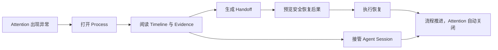

# 08 - Agent Process Console 用户指南

Agent Process Console 是 Agent Orchestrator 面向日常操作人员的图形控制台。它不要求你持续盯着每一个 agent 的进度，而是把真正需要人处理的审批、异常、失败和阻塞集中到 **Attention**，再提供时间线、证据、handoff、安全恢复和 Session 接管能力。

> 最重要的使用原则：让 agent 默认继续工作；只有出现需要判断的例外时，人再进入流程。

本文面向第一次使用 Console 的操作者，也可作为日常值班、恢复失败流程和接管 agent Session 的操作手册。升级、回滚和数据库恢复请使用 [Agent Process Console v1 Operations](../agent-process-console-v1-operations.md)。

## 1. 如果你只看一页

Console 最常见的工作流是：



遇到失败时，建议按这个顺序操作：

1. 在 **Attention** 中选中条目，先读清“需要你决定什么”。
2. 必要时点击 **Claim**，让其他操作者知道你正在处理。
3. 点击 **Open process**，查看语义时间线，而不是先翻原始日志。
4. 选中失败或测试条目，在右侧 **Evidence** 中核对证据。
5. 点击 **Generate handoff**，保存当前状态的短交接摘要。
6. 点击 **Review safe resume** 或 **Preview resume**，选择逻辑边界和恢复方式。
7. 阅读后果预览，填写操作原因，再执行恢复。
8. 如果必须与正在运行的 agent 交互，再进入 **Sessions** 请求 writer control。
9. 确认流程已经前进；对应 Attention 通常会自动关闭。

三个安全边界必须牢记：

- **安全恢复不是工作区回滚。** Console 的恢复计划不会回滚文件。
- **Repair orphaned running items 不是安全恢复。** 它只修复 worker 崩溃后遗留的 running 状态。
- **PID 不是 Session 写权限。** 输入必须持有当前 Session 的独占 writer lease 和 fencing token。

## 2. 开始之前

### 2.1 运行模型

Console 是 Tauri 客户端，CLI 也是客户端；二者都通过 gRPC/Unix Domain Socket 连接 `orchestratord`。daemon 持有 SQLite 状态、权限判断、幂等性、Session lease、恢复计划和审计证据。

```text
Console / CLI  ── gRPC / UDS ──>  orchestratord  ──>  SQLite + workers + agent processes
```

因此：

- Console 关闭不会停止 daemon 中的任务。
- 页面刷新不会让浏览器或 Tauri 成为状态权威。
- 不要直接编辑 SQLite 来“修复”Attention、Session 或流程状态。
- Console、CLI 和 daemon 最好来自同一个版本。

### 2.2 角色

Console 启动后会显示当前角色。最终权限始终由 daemon 判断。

| 能力 | `read_only` | `operator` | `admin` |
|---|---:|---:|---:|
| 查看 Attention、Timeline、Evidence、Handoff、Session、Source | 是 | 是 | 是 |
| Claim、Snooze、Resolve、执行允许的 Attention action | 否 | 是 | 是 |
| 生成 Handoff、预览/执行恢复、请求 Session writer control | 否 | 是 | 是 |
| Replay Source、修改系统资源或执行管理操作 | 否 | 否 | 是 |

按钮不可用时，先检查角色，再检查 RuntimePolicy。不要把隐藏按钮或前端状态当成权限来源。

### 2.3 功能开关

以下 RuntimePolicy 能力可能影响 Console：

| 能力 | 影响 |
|---|---|
| `attention_inbox_enabled` | 是否生成和读取 Attention |
| `handoff_enabled` | 是否允许生成 Handoff |
| `mutating_resume_enabled` | 是否允许执行普通安全恢复 |
| `elevated_resume_enabled` | 是否允许经额外确认重放非幂等边界 |
| `session_read_enabled` | 是否允许读取 Session；由 `_system` 策略全局决定 |
| `session_control_enabled` | 是否允许 writer control；由 `_system` 策略全局决定 |
| `source_ingest_enabled` | 是否接受新的外部 Source 事件 |
| `action_audit_mode` | 动作审计处于 `compatibility` 或 `enforced` |

Console 的五个主页面还可在构建时分别用 `VITE_CONSOLE_ATTENTION`、`VITE_CONSOLE_PROCESSES`、`VITE_CONSOLE_SESSIONS`、`VITE_CONSOLE_SOURCES` 和 `VITE_CONSOLE_SYSTEM` 关闭。页面显示 **Feature unavailable** 时，应由管理员检查构建开关，而不是反复重连。

## 3. 启动 Console

### 3.1 已安装版本

在一个终端启动 daemon：

```bash
orchestratord --foreground --workers 2
```

首次使用时，在另一个终端初始化运行时并做预检：

```bash
orchestrator init
orchestrator daemon status
orchestrator check --project <project>
```

然后启动已安装的 **Orchestrator GUI**。Console 会自动发现默认的 `~/.orchestratord/orchestrator.sock`。如果使用自定义数据目录，请在 daemon、CLI 和 GUI 进程中设置同一个 `ORCHESTRATORD_DATA_DIR`。

### 3.2 从源码运行

先构建 daemon、CLI 和前端：

```bash
cargo build --workspace --release
npm --prefix gui ci
npm --prefix gui run build
```

启动 daemon：

```bash
./target/release/orchestratord --foreground --workers 2
```

另开终端初始化并启动 GUI：

```bash
./target/release/orchestrator init
cargo run -p orchestrator-gui
```

桌面安装包的正式分发仍由 FR-076 负责；以上流程适用于当前源码和已有 Tauri 运行面。

### 3.3 连接成功的标志

连接成功后应看到：

- 左侧显示 **Orchestrator / Process Console**；
- 默认进入 **Attention**；
- 左下角显示当前角色；
- 顶部没有持续的断线错误；
- **Processes** 和 **System** 能加载 daemon 中的真实数据。

如果连接失败，Console 会显示连接状态和重试入口。先运行：

```bash
orchestrator daemon status
orchestrator db status -o json
```

## 4. 导航与快捷键

Console 使用稳定的左侧导航和可复制的本地 hash deep link。

| 页面 | Deep link | 用途 | 快捷键 |
|---|---|---|---|
| Attention | `#/attention` | 只看需要人处理的事项 | `Cmd/Ctrl+1` |
| Processes | `#/processes` | 所有流程及单流程工作区 | `Cmd/Ctrl+2` |
| Sessions | `#/sessions` | 跨流程查找和接管 agent Session | `Cmd/Ctrl+3` |
| Sources | `#/sources` | 外部事件、路由状态和流程来源 | `Cmd/Ctrl+4` |
| System | `#/system` | Operations、Agent、资源、Trigger、Store 和运行时 | `Cmd/Ctrl+5` |
| New process | `#/new-process` | 从一段目标描述创建新流程 | `Cmd/Ctrl+N` |

单条资源也有本地 deep link，例如：

- `#/attention/<attention-id>`
- `#/processes/<task-id>`
- `#/sessions/<session-id>`
- `#/sources/<task-id>`
- `#/system/operations`

这些链接用于同一台机器上的定位和交接，不是公开 Web URL，也不会包含 writer token、transcript 或操作权限。

窄窗口下，左侧导航会收起到 **Menu**。底部的 **Theme** 和 **Reduce transparency** 可切换主题和降低透明效果。

## 5. Attention：你的默认工作台

### 5.1 Attention 中会出现什么

Attention 只展示需要人参与的异常、审批、决策和阻塞。正常自主运行的任务不应出现在这里。

严重程度分为：

- **intervention**：通常需要尽快介入，排在队列前面；
- **attention**：需要关注或决策，但不一定要求立即中断其他工作。

重复的同类失败会聚合到一个活动条目，并增加 **Occurrences**，而不是无限制造重复通知。

### 5.2 三栏怎么读

Attention 桌面布局分为三栏：

1. **Queue filters**：按状态、严重程度和负责人过滤；
2. **Actionable list**：按严重程度和最近发生时间排序；
3. **Decision context**：显示请求的决策、流程、步骤、负责人、发生次数和 daemon 允许的动作。

常用过滤器：

| 过滤器 | 建议用途 |
|---|---|
| Open queue | 日常工作，只看未解决事项 |
| Claimed | 查看已经有人接手的事项 |
| Snoozed | 检查暂缓事项是否即将回到队列 |
| Resolved history | 复盘已解决事项 |
| Mine | 只看当前认证 actor 负责的事项 |
| Unassigned | 找还没有人处理的事项 |

### 5.3 操作一个条目

- **Claim**：声明由你处理；不会改变流程执行状态。
- **Snooze 1h**：暂时移出活动队列，一小时后恢复可见。
- **Resolve**：确认事项不再需要处理；审计历史仍保留。
- **Open process**：进入对应 Process Workspace。
- 其他按钮：由 daemon 在该条目的 allowlisted actions 中提供；执行前会显示确认对话框。

不要仅因为“看过了”就 Resolve 一个仍然失败的流程。优先让流程真正前进，由系统根据持久状态自动关闭 Attention。

### 5.4 Attention 键盘操作

当焦点不在输入框、下拉框或按钮中时：

| 按键 | 动作 |
|---|---|
| `j` / `↓` | 选择下一条 |
| `k` / `↑` | 选择上一条 |
| `c` | Claim |
| `s` | Snooze 1 小时 |
| `r` | 打开 Resolve 确认 |
| `Enter` | 打开关联 Process |

实时更新不会随意移动当前选择；如果服务要求重置快照，Console 会尽量保留同一个 Attention ID。

### 5.5 通知

Console 启动时会请求桌面通知权限。只有新打开或重新打开的可操作条目版本才会生成通知；普通更新和重连不会重复通知。

如果系统拒绝桌面通知：

- Attention 实时列表仍然工作；
- 页面会显示 in-app fallback；
- 屏幕阅读器仍能通过 live region 获得提示。

通知只包含受限标题、严重程度、Process ID 和 deep link，不包含 prompt、transcript、stdout/stderr、Source 正文或密钥。

## 6. Processes：理解流程，而不是追踪百分比

### 6.1 Process 列表

Processes 列出 daemon 中的任务，并优先显示运行中、暂停和失败的流程。运行中的条目会实时更新状态与进度。

打开流程后，顶部概览显示：

- 当前状态与目标；
- Workflow 和 Project；
- 未关闭 Attention 数量；
- 活跃 Session 数量；
- Task item 的完成进度。

这里的 **Process** 是面向用户的投影视图，持久化执行聚合仍然叫 `Task`。因此 UI 中的 Process ID 与 CLI 的 Task ID 是同一个标识。

### 6.2 Timeline

Timeline 是默认的解释界面。它把底层事件投影为稳定、有顺序的语义条目，包括：

- 目标与来源；
- 生命周期和循环；
- 执行步骤与工具；
- 测试、产物和证据；
- 失败原因；
- 人工动作、Session、恢复和完成状态。

先寻找最后一个成功条目，再看第一个失败条目，通常比从头阅读原始日志更快。条目较多时使用 **Load more**；实时缓冲会按稳定 ID 去重。

### 6.3 Evidence

点击 Timeline 条目后，右侧 **Evidence** 显示与该条目关联的证据引用，例如 command run、测试、产物、日志位置、Session 或 Checkpoint。

看到 `redacted` 表示内容经过脱敏。Evidence 是定位真实产物的引用，不保证把全部原始内容内嵌到页面。

### 6.4 Context rail

Timeline 右侧依次提供：

- **Evidence**：当前选中条目的证据；
- **Handoff & safe resume**：生成交接摘要并恢复；
- **Agent session**：读取 transcript 或请求 writer control；
- **Source bindings**：查看 Slack、fixture 或其他外部来源与该流程的绑定。

把这些能力放在同一工作区，是为了让你在做决定时不丢失失败上下文。

### 6.5 Expert 模式

点击 **Expert** 或按 `Cmd/Ctrl+E` 可查看：

- Trace JSON；
- 最多最近 500 行实时原始日志；
- 原始 Task/Item 技术详情；
- **Repair orphaned running items** 维护动作。

Expert 适合诊断，不应成为日常第一入口。特别注意：

> Repair orphaned running items 只把 worker 崩溃遗留的 running item 标记为可重试；它不会选择逻辑边界、不会恢复 provider Session，也不会回滚工作区。

## 7. Handoff 与安全恢复

### 7.1 什么时候生成 Handoff

以下情况适合生成 Handoff：

- 你准备把流程交给另一位操作者；
- 失败发生后，需要快速重建目标、当前状态和证据；
- 你准备恢复流程，希望保留恢复前的不可变快照；
- agent Session 已退出，但仍要让新的 agent 接手。

点击 **Generate handoff** 后，Console 生成一个不可变摘要，包含目标、当前状态、最后成功、失败、测试证据、变更文件、约束、决策、开放问题和建议。相同事件游标会得到相同内容哈希。

Handoff 是交接材料，不会自动恢复流程。

### 7.2 安全恢复的完整步骤

对失败流程点击顶部 **Review safe resume**，或在右侧点击 **Preview resume**：

1. 选择 **Logical boundary**。
2. 阅读边界的 side-effect class、可重放性和原因。
3. 选择恢复模式。
4. 点击 **Create preview**。
5. 阅读后果、计划过期时间和明确的 `Workspace rollback: never`。
6. 填写简短、可审计的 **Operator reason**。
7. 如果边界可能重复非幂等外部副作用，必须勾选 elevated confirmation；策略未启用时应停止。
8. 点击 **Execute reviewed plan**。
9. 查看结果；某些模式会创建关联的 child task。

计划会绑定创建时的状态版本。预览后如果流程或工作区状态已经改变，执行会以 stale 错误失败。这是保护机制：重新加载流程、重新选择边界并创建新计划，不要绕过版本检查。

### 7.3 四种恢复模式

| 模式 | 适用情况 | 关键注意点 |
|---|---|---|
| Continue task | 暂停流程可从当前状态继续 | 不重放已完成步骤 |
| Retry failed item | 只重试明确失败的 item | 确认失败操作具备可重试语义 |
| Restart from boundary | 从已声明逻辑边界创建恢复执行 | 可能生成关联 child task |
| Resume provider session | 重新进入已有 provider Session | 仅在边界声明 Session 可用时出现 |

如果边界显示 **Replay-safe**，仍应阅读原因；如果显示 **Elevated confirmation required**，先确认外部副作用能否被重复执行。不要为了“让按钮可用”而开启 elevated policy。

### 7.4 CLI 等价操作

```bash
# 1. 保存当前交接快照
orchestrator handoff generate <task-id> -o yaml

# 2. 查看可恢复边界
orchestrator resume boundaries <task-id>

# 3. 创建后果预览
orchestrator resume plan <task-id> \
  --boundary <boundary-id> \
  --mode restart_from_boundary \
  -o json

# 4. 使用 plan 返回的 ID 和 expected_state_version 执行
orchestrator resume execute <plan-id> \
  --expected-state-version <state-version> \
  --reason "Reviewed failure evidence and selected a replay-safe boundary" \
  --idempotency-key <stable-retry-key>
```

网络或客户端超时后重试第 4 步时，应复用同一个 idempotency key。

## 8. Sessions：读取、接管与释放 agent 会话

### 8.1 Session 列表

**Sessions** 让你不必先记住 Process 就能找回 agent 会话。可按 Active、Detached、Closed 或 All 过滤。

每一行显示：

- Agent；
- 关联 Task 和 Step；
- Session 状态；
- 当前 writer actor，或 `read-only`。

进入 **Session inspector** 后，可读取 transcript，并跳回关联 Process。

### 8.2 Reader 与 writer

- **Reader**：只读 transcript；多个 reader 可以有各自的 offset。
- **Writer**：可以向 agent 发送输入；同一 Session 同时只能有一个有效 writer。

Console 会保存每个 Session 的已提交读取 offset。断线重连后从该 offset 继续，并忽略已经收到的重复 chunk。

### 8.3 请求控制

1. 先阅读 transcript，确认 agent 当前在做什么。
2. 点击 **Request control**。
3. 成功后，Console 获得 writer lease 和递增的 fencing token。
4. 在输入框中输入内容，点击 **Send** 或按 `Enter`。
5. 完成后点击 **Release control**。

Console 会定期 heartbeat 续租。如果 lease 丢失、过期或被新的 fencing token 取代，旧 writer 不能继续输入或释放新 owner 的 lease。

输入使用幂等键保护。超时并不代表 agent 没有收到输入；让客户端按相同请求身份安全重试，不要快速重复发送不同请求。

### 8.4 关闭 Session

**Close session** 是受审计的进程关闭操作，不等于 Release control。只有确认 Session 不应继续运行时才关闭。

关闭由 Session ID、状态版本和进程指纹保护。PID 只用于诊断查找，永远不能单独授予关闭或输入权限。

### 8.5 CLI 等价操作

```bash
# 列出和查看
orchestrator agent session list -o json
orchestrator agent session get <session-id> -o json

# 从 offset 读取 transcript
orchestrator agent session read <session-id> --offset 0 --chunks-json

# 请求 writer lease；记录返回的 fencing token
orchestrator agent session attach <session-id> \
  --mode writer \
  --client-id terminal-a

# 发送一次幂等输入
orchestrator agent session send-input <session-id> \
  --client-id terminal-a \
  --fencing-token <token> \
  --text "Continue from the reviewed failure" \
  --idempotency-key input-001

# 释放 writer control
orchestrator agent session detach <session-id> \
  --mode writer \
  --client-id terminal-a \
  --fencing-token <token>
```

长时间由 CLI 持有 writer 时，还需要按 lease 返回值及时执行 `agent session heartbeat`。

## 9. Sources：从 Slack 和外部事件进入流程

Sources 展示 provider-neutral 的外部事件。Slack 是一个 adapter，不是 Process 的数据模型。

### 9.1 路由状态

| 状态 | 含义 | 通常动作 |
|---|---|---|
| received | 已持久化，等待路由 | 等待或检查 router |
| routing | 正在关联或创建流程 | 短暂等待 |
| routed | 已关联 Process | 点击 **Open process** |
| needs_attention | 无法安全决定路由 | 去 Attention 做人工决策 |
| failed | 路由失败 | Admin 查错后 Replay |
| ignored | 按策略忽略 | 通常无需动作 |

一个 Slack thread 的多次消息可以绑定到同一个 Process。新 thread、显式 branch 或歧义会按路由策略产生不同结果；系统不会在歧义时猜测目标流程。

### 9.2 Replay

只有 admin 能对 `failed` 或 `needs_attention` 事件执行 **Replay**。Replay 重新排队持久化事件，确定性的 Source、Task 和 action identity 会阻止重复副作用。

Replay 前先确认：

1. 签名、权限或路由策略问题已经修复；
2. 事件没有被人工绑定到错误 Process；
3. 上一次尝试是否已经产生外部副作用；
4. 相关 Attention 和 audit 记录能解释本次操作。

CLI 诊断：

```bash
orchestrator source list --project <project> --state failed -o json
orchestrator source get <source-event-id> -o json
orchestrator source bindings <task-id>
orchestrator source replay <source-event-id>
```

## 10. New process：从目标开始

点击左下角 **New process** 或按 `Cmd/Ctrl+N`，输入希望系统完成的目标。当前界面最多接受 2000 个字符，并用现有 wish-pool drafting 流程生成草案。

建议目标包含：

- 要改变或验证什么；
- 成功标准；
- 明确约束和不可触碰范围；
- 已知文件、Ticket 或外部上下文；
- 希望保留的验证证据。

输入后点击提交，或在文本框中按 `Cmd/Ctrl+Enter`。草案完成后：

- **Confirm development**：以草案目标创建正式执行任务；
- **Modify wish**：返回列表继续调整；
- **Cancel**：经确认后删除草案。

如果需要精确选择 Project、Workflow、Step 或 pipeline 变量，优先使用 CLI：

```bash
orchestrator task create \
  --name "upgrade-auth-flow" \
  --goal "Implement and verify the approved authentication change" \
  --workflow sdlc \
  --project product-a
```

## 11. System 与 Operations

System 保留平台管理和专家入口：

| 分区 | 用途 |
|---|---|
| Operations | 查看项目级 Process 健康与 projector 状态 |
| Agents | 查看和管理 agent |
| Workflows & Resources | 管理声明式资源与工作流 |
| Triggers | 管理定时和事件触发 |
| Stores | 查看工作流持久化存储 |
| Secrets | 管理加密 SecretStore 和密钥相关操作 |
| Runtime & Connection | 查看运行时、连接和诊断信息 |

### 11.1 读 Operations

进入 **System → Operations**，输入 Project，并选择 1 小时、24 小时或 7 天窗口。常用指标包括：

- Attention opened / active；
- Time to claim；
- Human attention；
- Autonomous completion；
- Handoff to action；
- Resume attempts；
- Session attachments；
- Source deduplicated；
- Repeated failure 和 degenerate loops；
- Timeline latency、response size 和 stream reconnects。

Operations 是趋势和分诊工具，不是取证真相。需要解释一次具体动作时，回到 Timeline、Evidence 和 Audit。

以下状态值得注意：

- **Fresh snapshot**：数据最近生成；
- **Stale snapshot**：刷新时间超过预期；
- **Collection disabled**：指标采集被策略关闭，不影响流程执行；
- **Partial historical coverage**：窗口早于当前保留数据；
- projector lag/failure：投影需要检查，但权威业务状态仍在领域表和事件中。

CLI 查询：

```bash
orchestrator metrics process \
  --project <project> \
  --window 24h \
  --bucket 1h \
  -o json
```

## 12. 四个日常操作剧本

### 12.1 失败流程恢复

1. Attention 中 Claim。
2. Open process。
3. 找到最后成功和首个失败 Timeline 条目。
4. 检查 Evidence；必要时进入 Expert 看日志。
5. Generate handoff。
6. Review safe resume。
7. 选择 replay-safe 边界，创建预览并填写原因。
8. Execute reviewed plan。
9. 确认 child task 或原任务已经推进，Attention 自动关闭。

### 12.2 审批或人工决策

1. 阅读 Attention 的 requested decision，而不只看标题。
2. 检查关联 Timeline、Source provenance 和 Evidence。
3. 只执行 daemon 广告的 action。
4. 确认对话框中的状态变化和审计提示。
5. 如果不再需要动作，填写明确原因后 Resolve。

### 12.3 接管 Claude Code 或其他 agent Session

1. 从 Process context rail 或 Sessions 打开目标 Session。
2. 先以 reader 身份看 transcript。
3. 确认当前没有其他 writer，或与当前 owner 协调。
4. Request control。
5. 发送一条短、可验证的指令。
6. 观察 transcript 和 Process Timeline 是否推进。
7. Release control；不要把 lease 长期闲置。

### 12.4 Source 路由失败

1. Sources 按 `failed` 或 `needs_attention` 过滤。
2. 检查 provider、installation、conversation/thread 和 error code。
3. 查看对应 Attention 和 Audit。
4. 修复签名、actor role、Trigger 或绑定策略。
5. Admin 执行 Replay。
6. 确认只生成一个目标 Process 或绑定，没有重复副作用。

## 13. CLI 备用入口

GUI 暂时不可用时，核心操作仍可通过同一 daemon 的 CLI 完成。

```bash
# Attention
orchestrator attention list --project <project>
orchestrator attention get <attention-id>
orchestrator attention claim <attention-id> --expected-version <version>
orchestrator attention resolve <attention-id> \
  --expected-version <version> \
  --reason "Resolved after reviewed recovery"

# Process / Timeline
orchestrator task info <task-id> -o yaml
orchestrator task timeline <task-id>
orchestrator task timeline <task-id> --category failure --follow
orchestrator task logs <task-id> --timestamps

# Audit
orchestrator audit list --project <project> --status failed -o json
orchestrator audit get <request-id> --project <project>

# Operations
orchestrator metrics process --project <project> --window 24h --bucket 1h
```

查看当前二进制自己的命令帮助，优先于复制旧文档：

```bash
orchestrator guide task
orchestrator guide attention
orchestrator guide session
orchestrator guide source
orchestrator guide audit
orchestrator handoff --help
orchestrator resume --help
orchestrator metrics --help
```

## 14. 故障排查

### Console 显示 Disconnected

1. 运行 `orchestrator daemon status`。
2. 检查 daemon 终端日志。
3. 确认 CLI 和 GUI 使用相同 `ORCHESTRATORD_DATA_DIR` 或 control-plane 配置。
4. 点击 Console 的 Retry。
5. 不要通过复制或修改 live SQLite 文件解决连接问题。

### Attention 为空

这通常是好事。确认：

- 当前过滤器是否为 Open queue；
- 是否误选了 Mine、某个严重程度或 resolved history；
- `attention_inbox_enabled` 是否启用；
- 目标 Process 是否真的产生需要人处理的事件。

普通运行中 Process 不出现在 Attention 是设计行为。

### 按钮不可用或消失

按顺序检查：

1. 当前角色是否满足要求；
2. 对应 RuntimePolicy 是否启用；
3. Session read/control 是否由 `_system` 策略启用；
4. 当前状态是否允许该动作；
5. 页面是否被 `VITE_CONSOLE_*` 构建开关关闭。

不要仅修改前端来绕过按钮状态，daemon 仍会拒绝请求。

### Attention 或恢复报告 stale version

说明你查看的数据已经被另一个操作者或流程更新：

1. Refresh snapshot 或重新打开 Process；
2. 重新读取当前 version/state version；
3. 重新生成恢复 plan；
4. 再次审阅后果后执行。

### Session 无法 Request control

可能原因：

- `_system.session_control_enabled=false`；
- 当前角色是 `read_only`；
- 已有未过期 writer；
- Session 已退出、关闭或进程指纹不匹配；
- 旧 fencing token 已失效。

先刷新 Session；不要用 PID 直接发送输入或杀进程来抢 lease。

### Session transcript 重复或断开

Console 会按 `next_offset` 去重并从已提交 offset 重连。等待自动重连；持续失败时记录 Session ID 和请求 ID，再检查 daemon 日志。不要清除持久状态来“重置 offset”。

### Source 一直 failed

在 Replay 前检查签名时间窗、provider 配置、Trigger、actor role、绑定歧义和 `source_ingest_enabled`。重复 Replay 不能修复确定性的配置错误。

### Operations 没有数据或显示 stale

- 确认 Project 拼写；
- 切换到更大的窗口；
- 检查 collection enabled、coverage 和 projector health；
- 使用 CLI 重新查询；
- 指标失败不会阻断流程，不要因此修改权威 Task 状态。

### 错误中出现 request ID

保留完整 request ID，用它查询审计并关联 daemon 日志：

```bash
orchestrator audit get <request-id> --project <project>
```

不要只截取错误文案；request ID 能区分授权失败、stale、fencing、策略拒绝和领域错误。

## 15. 可访问性与舒适使用

- 所有关键操作都可用键盘完成；对话框支持 `Escape`、焦点限制和关闭后的焦点恢复。
- 状态同时使用文字和形状，不只依赖颜色。
- 系统开启 reduced motion 时，非必要动画会被移除。
- 不支持 backdrop blur 或启用 **Reduce transparency** 时，界面使用不透明背景。
- 只读用户不会获得隐藏但仍可聚焦的 mutation 或 Session input 控件。
- 窄窗口下内容按顺序堆叠，不应产生整页水平滚动。

如果视觉透明度影响阅读，优先打开 **Reduce transparency**，而不是改变系统数据或关闭功能页面。

## 16. 使用习惯建议

- 每天从 Attention 开始，而不是从所有 Process 开始。
- Claim 代表你正在负责，不代表问题已经解决。
- 先看语义 Timeline 和 Evidence，最后才看原始日志。
- 每次跨人、跨 Session 或跨恢复边界时生成 Handoff。
- 恢复前始终创建并阅读 consequence preview。
- 在 Operator reason 中写“为什么这个边界现在安全”，不要只写 `retry`。
- Session 输入保持短小、单一意图、可验证。
- 用完 writer control 立即 Release。
- Source Replay 前先修复确定性原因。
- 具体动作取证使用 Audit；趋势判断使用 Operations。
- 不直接修改 SQLite，不删除迁移记录，不把 normal rollback 当成 database rollback。

## 17. 术语表

| 术语 | 含义 |
|---|---|
| Process | 面向操作者的执行投影；当前由持久化 Task 及其子资源支撑 |
| Task | daemon 中的持久化执行聚合，也是 CLI 使用的名称 |
| Attention item | 需要人判断或操作的持久化队列条目 |
| Timeline | 从事件构建的稳定、分页、语义化只读投影 |
| Evidence | 与 Timeline 条目关联的测试、命令、产物、日志等引用 |
| Handoff | 某一事件游标上的不可变交接摘要 |
| Resume boundary | daemon 声明的可恢复逻辑边界及副作用分类 |
| Resume plan | 有过期时间、绑定状态版本、执行前不改变状态的后果预览 |
| Session reader | 从独立 offset 读取 transcript 的只读连接 |
| Writer lease | Session 的独占、可续租输入权限 |
| Fencing token | 单调递增的 writer 代次；旧 token 不能影响新 owner |
| Source event | 已认证、标准化并先持久化的外部事件 |
| Source binding | 外部 conversation/thread 与 Process 的持久关联 |
| Request ID | 串联传输授权、领域动作、事件和审计证据的请求标识 |

## 18. 相关文档

- [01 - 快速开始](01-quickstart.md)：构建 daemon、CLI 并运行第一个 Workflow。
- [02 - 资源模型](02-resource-model.md)：理解 Project、Workspace、Agent 和 Workflow。
- [07 - CLI 参考](07-cli-reference.md)：CLI 命令速查。
- [Agent Process Console v1 Operations](../agent-process-console-v1-operations.md)：升级、发布、stop-loss、回滚和灾难恢复。
- [Process Console Release Acceptance Design](../../design_doc/orchestrator/116-process-console-release-acceptance.md)：发布范围、兼容边界、迁移和回滚设计。
- [Process Console Information Architecture](../../design_doc/orchestrator/110-process-console-information-architecture.md)：UI 信息架构与权限设计。
- [Process Console Release Acceptance](../../qa/orchestrator/153-process-console-release-acceptance.md)：当前发布验收证据。
